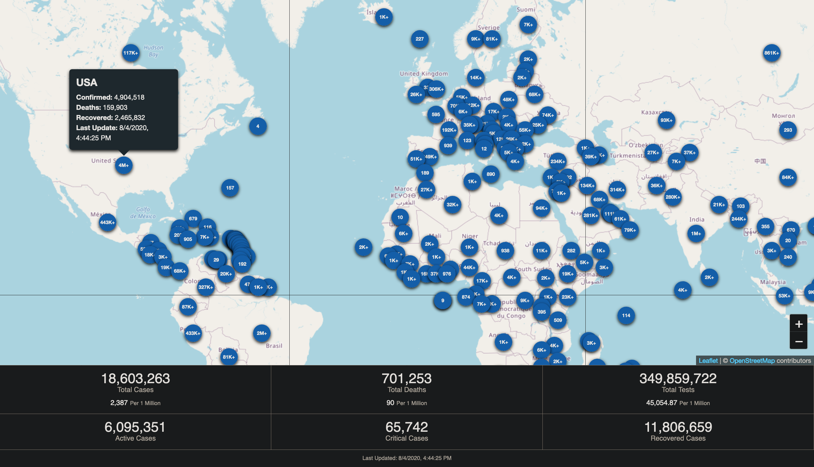

# 🦠 COVID-19 Dashboard & Map

COVID-19 dashboard and map built with [Gatsby](https://www.gatsbyjs.org/) and [React Leaflet](https://react-leaflet.js.org).

This dashboard includes data related to cases, deaths, and testing efforts. Information at a country level is dsplayed on cards that are activate don hover. Information at a global level (i.e. sum of all data) is displayed at the bottom of the page.

## 🗒️ Resources

-   World Health Organization (WHO): https://www.who.int/
-   US CDC: https://www.cdc.gov/coronavirus/2019-ncov/index.html
-   European Centre for Disease Prevention and Control (ECDC): https://www.ecdc.europa.eu/en/geographical-distribution-2019-ncov-cases

---

Includes contributions from Colby Fayock
